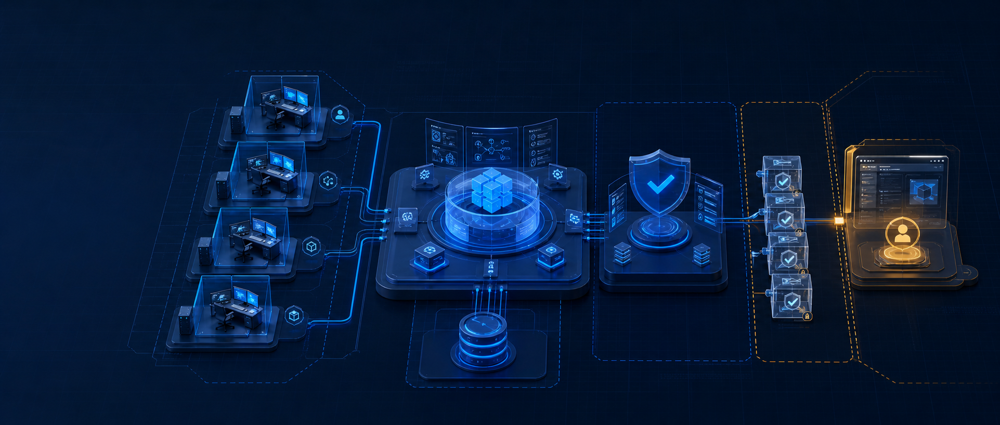
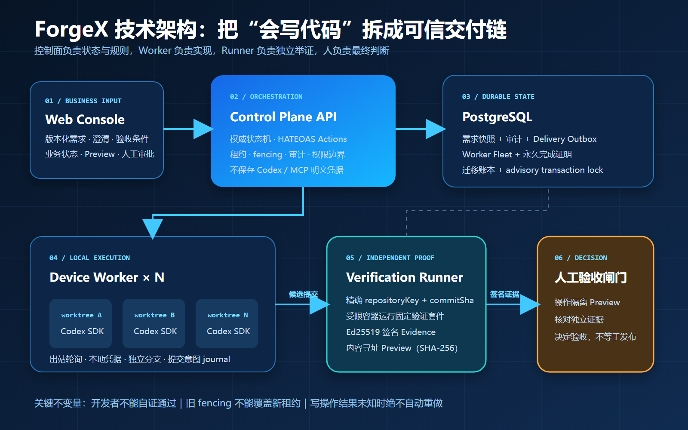
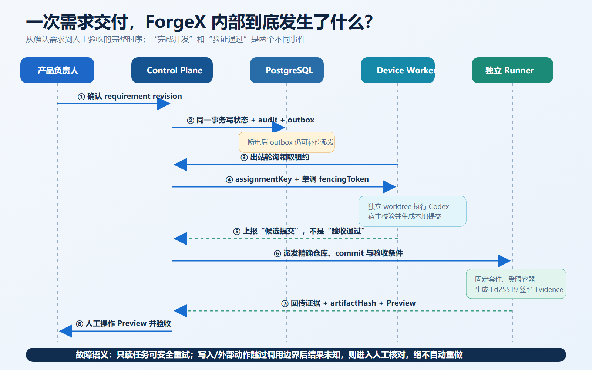
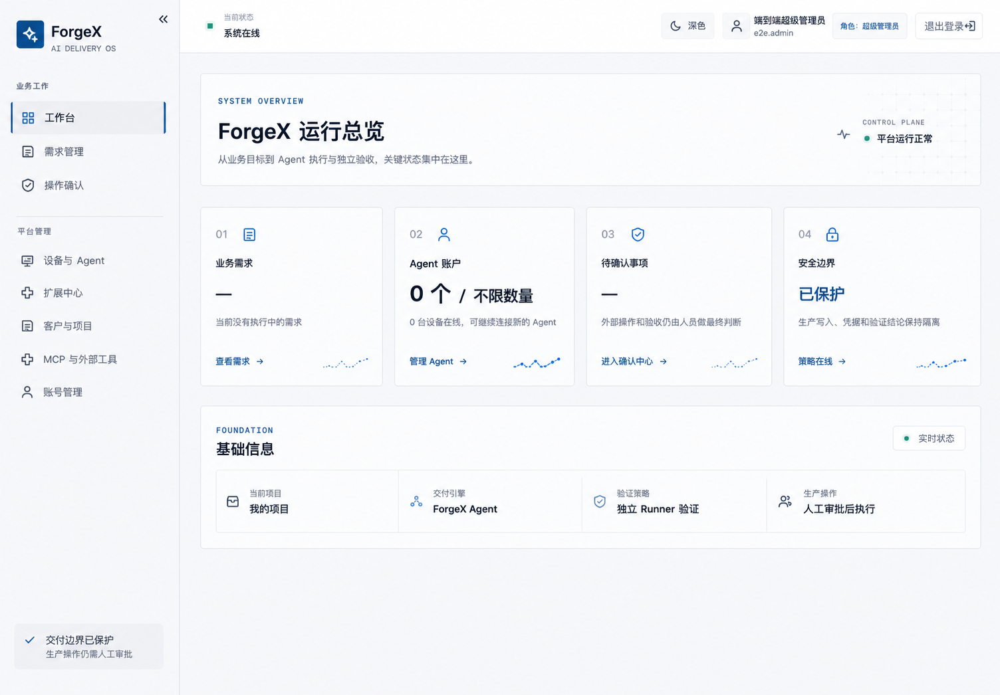

# 当 10 个 AI 同时写代码，谁来阻止第 11 个事故？

> 我们拆开 ForgeX 的技术底座：它不是“再套一层聊天 UI”，而是一套用状态机、事务、租约、fencing、独立签名证据和人工闸门约束 AI 交付的控制面。

如果把十个 AI 编程 Agent 同时接进十个仓库，软件交付速度会提升十倍吗？

未必。

更可能先得到十倍的并发问题：同一个需求被重复执行、旧任务在断线后突然回写、两个 Agent 抢同一份工作区、测试报告无法对应准确提交，以及一条写操作在超时后被“聪明地”重试两次。

AI 会写代码，只解决了执行层的问题。团队真正需要的是另一套系统：

**谁有权启动任务？执行的是哪一版需求？哪个设备拿到了租约？结果对应哪个 Git 提交？验证者是否独立？失败后究竟能不能重试？**

这就是 ForgeX 想解决的问题。

ForgeX 是一个开源的 AI 软件交付控制面。它不追求把 AI 包装成“无人公司”，而是把需求、执行、证据和决策拆到不同的信任域里。

## 一张图看懂：ForgeX 不是 Agent，而是 Agent 上面的交付系统

整个系统可以拆成六块。

Web Console 面向产品经理、需求分析师和研发，用业务语言展示版本化需求、澄清问题、验收条件和下一步动作。

Control Plane API 保存权威状态机。客户端不能自己拼一个 `requirementKey` 就宣布开工，也不能在请求体里自报“我是审批人”。可执行动作由服务端根据当前状态和角色给出，审批身份来自已认证会话，时间来自服务端时钟。

PostgreSQL 不只是“存点数据”。生产边界里，需求快照、审计事件和 Delivery Outbox 在同一事务提交；项目写事务使用 advisory transaction lock。数据库迁移带编号、SHA-256 校验和迁移账本，readiness 会拒绝不完整或发生漂移的迁移链。

Device Worker 运行在客户设备上，通过出站心跳和轮询领取任务。Codex 的登录态、OAuth Token 和 API Key 不上传控制面。每个任务进入独立 Git worktree 和独立分支，Worker 绑定并复核项目、仓库、需求版本、基线提交和目标提交。

Verification Runner 与开发 Worker 分离。它针对准确的 `repositoryKey + commitSha` 执行固定验证套件，并用独立 Ed25519 私钥签名 Evidence。开发 Agent 没有这把私钥，所以不能给自己的提交签发“独立验证通过”。

最后才是人工验收。Runner 通过只意味着可以进入产品验收，不等于允许发布生产。

## 为什么一定要有 outbox：因为“确认成功，派发失败”真的会发生

一次交付至少会跨越需求仓储和设备队列。

最危险的写法是：先把需求状态改成“正在交付”，再调用队列派发。如果进程恰好在两步之间崩溃，页面看起来已经开工，设备却永远收不到任务。

ForgeX 把“进入交付”和写入 `DeliveryDispatchRecord` 放在同一个 PostgreSQL 事务里。派发器随后把 outbox 幂等写入设备队列，再回写派发时间和审计事件。

即使进程在中间退出，后续合法 Worker 轮询也会重新扫描 pending outbox。重复派发则由 `projectKey + requirementKey + requirementRevision` 的唯一语义吸收。

这不是最炫的功能，却是系统从 Demo 走向可恢复运行的分界线。

## 为什么租约还不够：过期 Worker 可能“死而复生”

假设设备 A 拿到任务后断网。租约到期，控制面把任务重派给设备 B。B 已完成并上报；此时 A 恢复网络，又提交了一份基于旧上下文的结果。

仅检查“任务 ID 相同”远远不够。

ForgeX 的每次分配都带 `assignmentKey` 和单调递增的 `fencingToken`。设备续租、完成证明和最终交付记录都绑定这两个值。新的租约产生后，旧 token 的迟到写入会被拒绝，不能覆盖较新的执行结果。

设备重连还会提升连接代次，旧代次随即失效。这套机制必须落在共享 PostgreSQL 边界里；如果每个 API 副本只维护自己的内存状态，fencing 就失去了意义。

## “Agent 完成了”为什么不能直接变成“需求通过了”

ForgeX 刻意把两句话拆开：

- Worker 完成：产生了一个可追踪的候选提交；
- Runner 通过：这个准确提交满足了一组被签名绑定的检查条件。

一份可信 Evidence 会绑定租户、项目、代码仓库、需求版本、完整 Git SHA、产物摘要、每条验收条件、Runner 身份和 `keyId`。

控制面只保存 Runner 公钥。证据跨租户、跨项目、跨仓库或跨需求版本复用时会直接失败；`evidenceKey` 具有唯一约束以防重放；证据还有有效期和有限的未来时钟偏差。

从数据库恢复工作流时，ForgeX 不会因为 JSON 里写着 `passed: true` 就相信它。系统会重新核对 Runner 授权范围、公钥和 Ed25519 签名。

这才是“Agent 不能自证通过”的技术含义。

## Preview 也不是一个随便粘贴的 URL

很多 AI 平台会让执行端返回一个预览地址。方便，但这等于允许不可信执行端把用户带往任意页面。

ForgeX 的普通页面只打开控制面生成的同源 Preview 地址。Preview 制品与 Runner 签名的 `artifactHash` 绑定，以内容寻址方式存储；读写时都会重新计算 SHA-256，且不允许覆盖。

展示时，制品被放进受限 sandbox iframe：没有同源权限、表单提交、弹窗和顶层导航，父页面 CSP 也禁止网络连接。

产品负责人看到的因此不是“Agent 推荐你点开的网页”，而是与已验证提交精确绑定的一份隔离制品。

*真实控制台界面：业务工作与平台管理分区，普通视图集中呈现需求、Agent、待确认事项和安全边界。*

## MCP 最难的不是调用，而是失败之后怎么办

ForgeX 支持把 MCP 工具纳入交付，但不会把所有工具都当成普通函数。

只读能力可以按可信 Manifest 自动排队；写入和外部动作必须由产品负责人或管理员确认。控制面会固化服务版本、Manifest 摘要、输入 Schema 摘要和规范参数摘要，但连接凭据仍只存在客户设备的私有配置中。

更关键的是故障语义：

- 只读操作在租约过期后，可以由更高 fencing 的执行者安全接管；
- 写入或外部动作一旦越过真实调用边界，却没有拿到可信结果，系统会进入“结果待人工核对”；
- 此时绝不自动重做，因为第一次调用可能已经在外部系统生效。

这比简单设置一个 `retry: 3` 麻烦得多，却能避免“超时一次，扣款两次”这类经典事故。

## ForgeX 当前做到哪一步了？

当前仓库版本是 `0.1.0` 预发布版，已经包含：

- TypeScript Control Plane 与 Web Console；
- PostgreSQL 持久化、迁移账本、需求/outbox/审计事务边界；
- 不限固定产品数量上限的设备舰队、租约、fencing 和永久完成证明；
- 基于官方 Codex SDK 的本地隔离 Worker；
- 独立验证 Runner、Ed25519 Evidence 和内容寻址 Preview；
- 可信 Skill、引用优先知识库、MCP 注册与受控调用链路；
- Docker Compose 本地部署和自动化测试入口。

边界同样明确：它目前不承诺任意技术栈的一句话生成，不自动合并主分支，不自动发布生产，也不自动执行生产数据库迁移和事故处置。公开上线前仍需接入组织身份源、TLS、备份和监控，并完成真实 PostgreSQL 并发、迁移及故障注入验证。

## 写在最后

AI 软件开发的真正瓶颈，正在从“生成能力”转向“系统可信度”。

当一个 Agent 工作时，提示词也许够用；当十个 Agent 跨设备、跨仓库、跨工具同时工作时，你需要的是状态机、事务、租约、fencing、幂等、签名证据、隔离执行和人工闸门。

换句话说：

**AI 负责提高交付速度，ForgeX 负责让这份速度不越过安全边界。**

这可能没有“一句话生成一个公司”那么魔幻。

但它更接近团队真的敢用、敢验、敢接手的软件工程。
